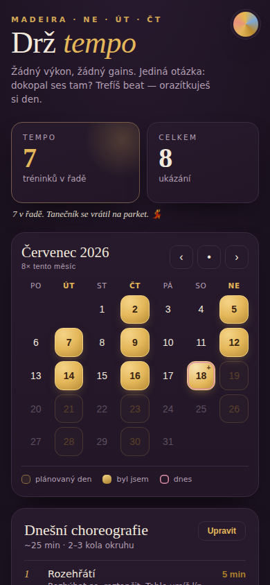

# Drž tempo 🏋️

Minimalistická webová appka na jedinou věc: **dokopat se pravidelně do gymu.**

Žádné počítání kalorií, žádné výkonnostní tabulky. Jediná otázka zní: *dokopal ses tam?*
Když ano, orazítkuješ si den v kalendáři a držíš tempo.

## Co umí

- 📅 **Kalendář docházky** — kliknutím orazítkuješ den, kdy ses ukázal. Tréninkové dny (Ne · Út · Čt) jsou zvýrazněné, návštěva mimo plán se počítá jako bonus (+).
- 🔥 **Tempo (streak)** — počítá tréninky v řadě podle plánovaných dnů a povzbuzuje hláškami.
- 📝 **Choreografie pro každý den zvlášť** — tréninkové dny mají vlastní plány (Den A · Ne, Den B · Út, Den C · Čt). Cviky přepíšeš, přeskládáš, doplníš — a když chceš všude stejný plán, jedním tlačítkem ho zkopíruješ do všech dnů.
- 🔎 **Našeptávač cviků** — při psaní názvu cviku vybíráš z katalogu ~40 nejběžnějších cviků (dřepy, mrtvé tahy, přítahy, tlaky, core…); vybraný cvik rovnou předvyplní série × opakování i techniku.
- 🎨 **5 barevných témat** — tmavé, světlé a tři pastelová; při prvním spuštění se řídí nastavením systému.
- 💾 **Záloha a obnova** — data žijí jen v prohlížeči (localStorage), jedním klikem je vyexportuješ do JSON souboru a kdykoli zase nahraješ (třeba na novém telefonu).
- 📴 **Funguje offline** — po první návštěvě se appka uloží do cache (service worker) a jede i bez internetu.
- 📱 **Dá se nainstalovat** — na telefonu přes „Přidat na plochu“ se chová jako nativní appka.

## Jak to rozjet

Appka je čistě statická — žádný build, žádné závislosti.

**GitHub Pages (doporučeno):**
1. V repozitáři otevři **Settings → Pages**.
2. V sekci *Build and deployment* zvol **Deploy from a branch**, vyber hlavní větev a složku `/ (root)`.
3. Za chvíli appka poběží na `https://kuba-david.github.io/DrzTempo/`.
4. Na telefonu ji otevři v prohlížeči a dej **Přidat na plochu** — od té chvíle funguje i offline.

**Lokálně:** stačí otevřít `index.html` v prohlížeči. (Bez serveru nefunguje jen offline cache — na samotnou appku to nemá vliv.)

## Kde jsou moje data

Všechno (razítka, cviky, téma) se ukládá **jen lokálně v prohlížeči**. Nikam se nic neposílá.
Proto se hodí občas kliknout na **„zálohovat data“** dole na stránce — a při výměně telefonu zálohu nahrát přes **„obnovit zálohu“**.

## Struktura

| Soubor | K čemu je |
|---|---|
| `index.html` | celá appka (HTML + CSS + JS v jednom) |
| `manifest.webmanifest` | manifest pro instalaci na plochu |
| `sw.js` | service worker pro offline režim |
| `icons/` | ikony appky |
